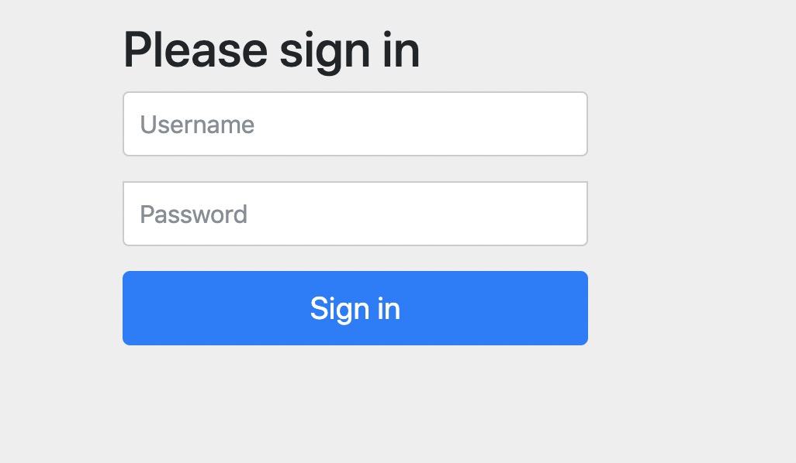
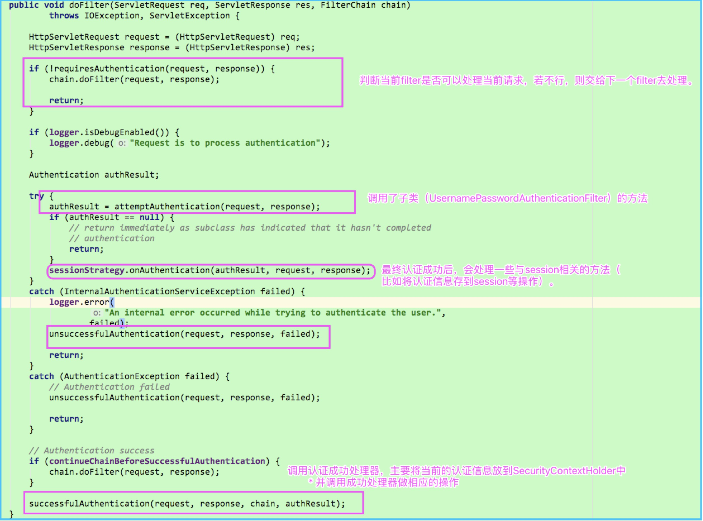
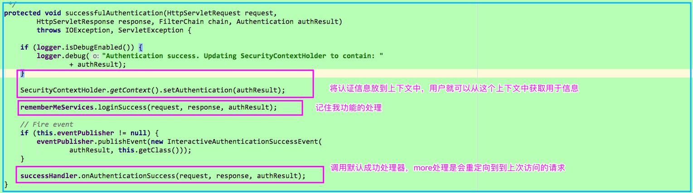
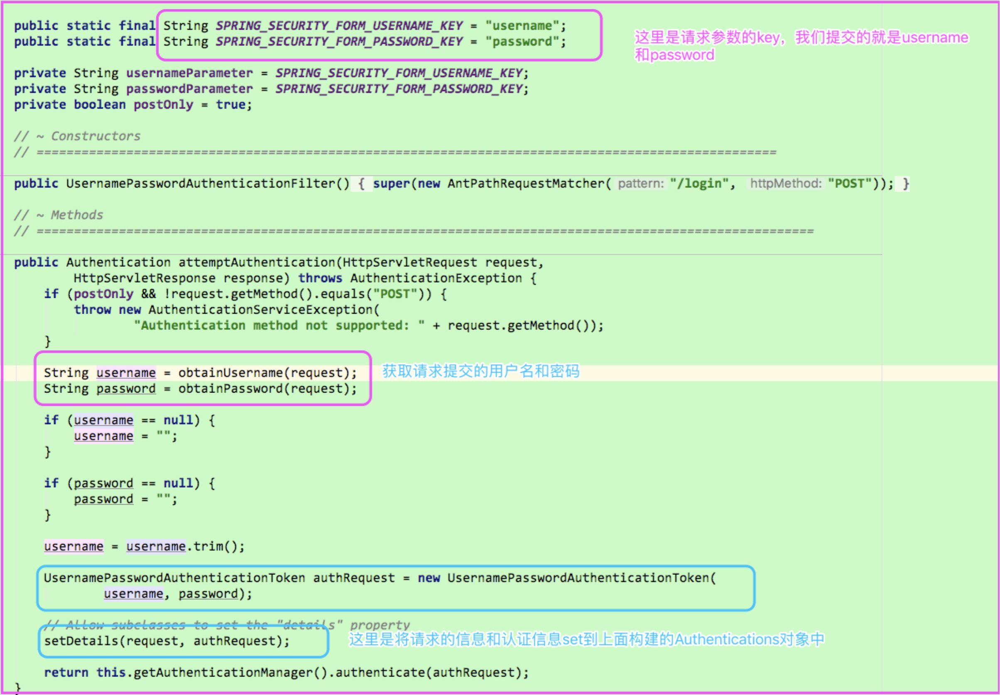
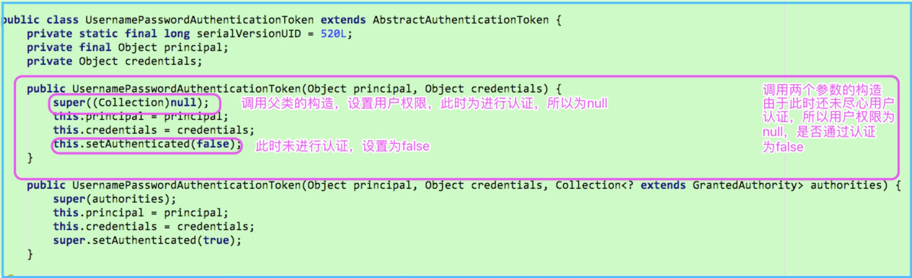
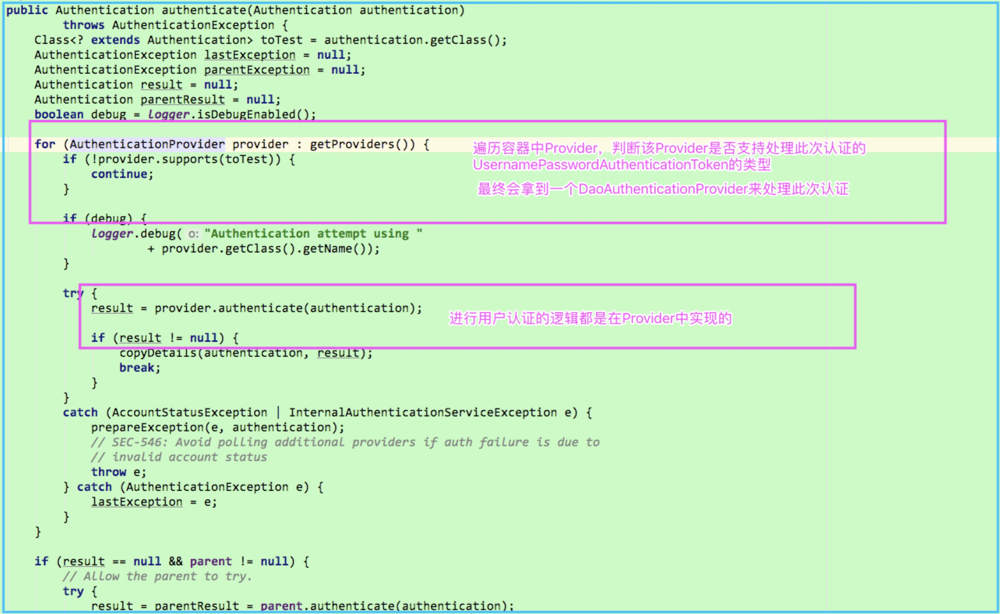
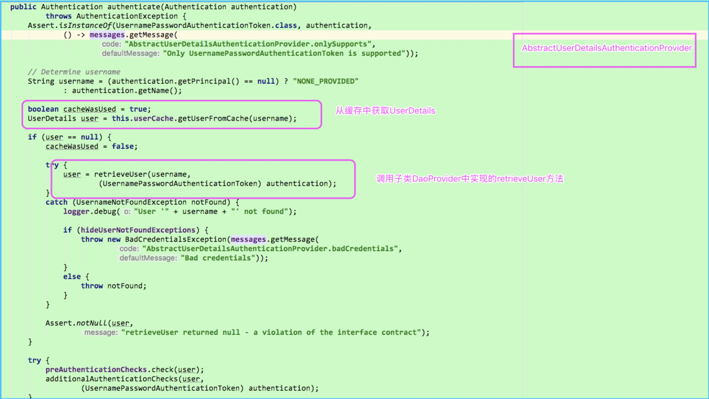
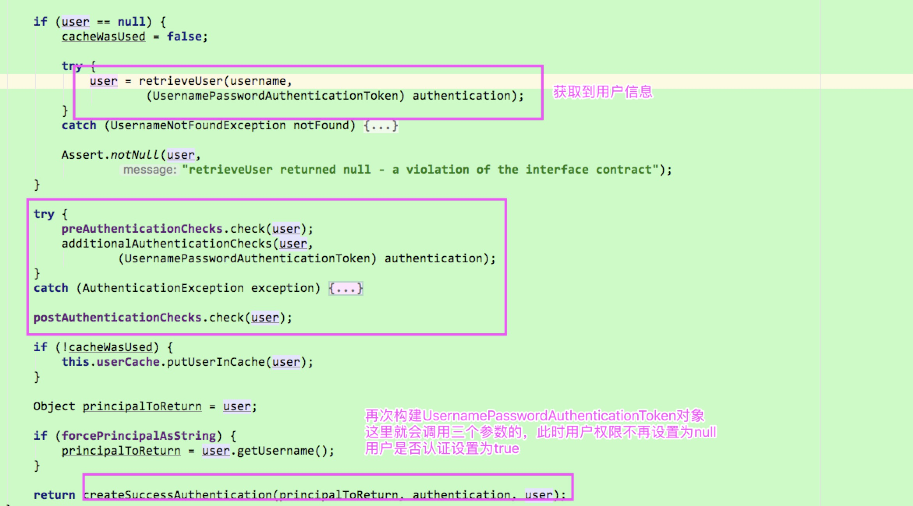

## SpringSecurity

### 1 入门案例

> 项目中导入SpringSecurity的依赖，查看SpringSecurtit提供的默认配置

- 导入SpringSecurity启动器
这里使用的SpringSecurity5
```xml
<dependency>
        <groupId>org.springframework.boot</groupId>
        <artifactId>spring-boot-starter-security</artifactId>
</dependency>
```

- 提供一个Web接口
`study.wyy.security.web.controller.HelloSecurityController`
```java
@Api(value = "SpringSecurity入门",tags = "SpringSecurity入门")
@RestController
public class HelloSecurityController {


    @ApiOperation("SpringSecurity入门测试")
    @GetMapping("/hello")
    public String hello(){
        return "Hello Spring Security";
    }
}
```

- 访问
`http://127.0.0.1:8080/hello`

会发现跳转到一个登录页面


> 此时用户名为user，密码是在启动项目的时候控制台会输出的

`
Using generated security password: 89a5131d-534d-4dc7-b693-4dbaba502336`

登录成功后就会访问到我们提供的API
这里也继承了Swagger，所以访问swagger-ui.html的时候也是会被拦截需要登录的

> tips

Security5默认提供的是表单登录，之前的版本提供的是httpbasic登录

####   增加注册功能

- 处理注册的Rest接口
这里使用了Springsecurity提供的密码加密工具进行了加密
`study.wyy.security.web.controller.RegisterController`
```
@PostMapping("/register")
public String register(@RequestBody UserInfo userInfo){
    log.info("注册用户条的信息：{}",userInfo);
    Long aLong = userInfoService.create(userInfo);
    if(aLong != null){
        return "success";
    }
    return "fail";

}
```
- 注册接口是不需要拦截，配置security不拦截注册请求
声明一个配置类，继承`WebSecurityConfigurerAdapter`,并使用`@EnableWebSecurity`
开启配置
```java
import org.springframework.security.config.annotation.web.configuration.WebSecurityConfigurerAdapter;

@Configuration
@EnableWebSecurity
public class SecurityConfig extends WebSecurityConfigurerAdapter {

    @Override
    protected void configure(HttpSecurity http) throws Exception {
        http.authorizeRequests()
                // 配置注册接口和swagger接口不需要身份验证
                .antMatchers("/register").permitAll()
                .anyRequest()
                .authenticated()
                .and()
            .formLogin();
        http.csrf().disable();
    }
}
```

### 2 自定义form表单登录流程
我们已经有了自己注册逻辑，接下来如何自定义自己的登录流程，不使用SpringSecurity提供的表单和登录校验，并接入到SpringSecurity中

#### 2.1 提供一个表单登录页面
`static/login.html`

```java
<!DOCTYPE html>
<html lang="en">
<head>
    <meta charset="UTF-8">
    <title>注册</title>
</head>
<body>
<div>
    <form action="/auth/form" method="post">
        <label>用户名</label><input name="username"/>
        <label>密码</label><input name="password"/>
    </form>
</div>

</body>
</html>
```
- 配置我们登录页面和处理登录的请求地址
- 同样配置该页面不需要被拦截和处理登录请求的地址不需要身份验证

#### 2.2 实现`org.springframework.security.core.userdetails.UserDetailsService` 接口
`study.wyy.security.service.impl.UserInfoServiceImpl`实现上述接口（也可重新声明一个该接口的实现类）

- 实现loadUserByUsername方法
该方法内部就可以实现查询自己的数据库的用户信息，并返回UserDetails接口的实现
- 将该实现类注入的Spring容器中，这里之前已经使用`@Service`注解注入到容器中了
#### 2.3 实现UserDetails接口
发现loadUserByUsername方法的返回值是UserDetails，其实这个就是SpringSecurity用于封装
认真信息的接口，所以可以让我们数据库对应的用户表的实体类实现这个接口，当然也可以另外声明实现，将需要的信息封装进去

UserDetails接口介绍：
声明了几个校验用户的的方法，最终交给SpringSecurity去执行，比如用户是否过期，是否冻结等等的
`study.wyy.security.pojo.UserInfo` 这里使用的就是数据表对应的实体类实现了该接口。

#### 2.4 测试
访问hello接口，会跳转到我们的登录页面，输入用户名密码登录

此时会报错，内容如下：
```java
java.lang.IllegalArgumentException: There is no PasswordEncoder mapped for the id "null"
	at org.springframework.security.crypto.password.DelegatingPasswordEncoder$UnmappedIdPasswordEncoder.matches(DelegatingPasswordEncoder.java:250) ~[spring-security-core-5.2.0.RELEASE.jar:5.2.0.RELEASE]
	at org.springframework.security.crypto.password.DelegatingPasswordEncoder.matches(DelegatingPasswordEncoder.java:198) ~[spring-security-core-5.2.0.RELEASE.jar:5.2.0.RELEASE]
```
SpringSecurity5要求必须配置一个密码加密的工具（容器中必须注入一个PasswordEncoder）
我们注册时候是使用的密码加密工具是BCryptPasswordEncoder，我们在容器中注入即可（前面留下的伏笔）

```java
package study.wyy.security.config;

import org.springframework.boot.autoconfigure.condition.ConditionalOnMissingBean;
import org.springframework.context.annotation.Bean;
import org.springframework.context.annotation.Configuration;
import org.springframework.security.crypto.bcrypt.BCryptPasswordEncoder;
import org.springframework.security.crypto.password.PasswordEncoder;

@Configuration
public class BeanConfig {

    @Bean
    public PasswordEncoder passwordEncoder(){
        return new BCryptPasswordEncoder();
    }
}

```

- 提供一个配置类`study.wyy.security.config.BeanConfig`，用于配置bean

再次访问hello接口，跳转到登录页面（这个也是SpringSecurity提供的），登录成功，会跳转到hello接口（SpringSecurity默认的登录成功处理）

### 3 源码解读

> 明确的是：SpringSecurity的核心就是一串过滤器

上述过程的核心流程是：
- AbstractAuthenticationProcessingFilter




- `UsernamePasswordAuthenticationFilter`：处理表单登录请求的的核心过滤器，AbstractAuthenticationProcessingFilter的子类



最后会获取认证管理器进行用户认证
 
- `UsernamePasswordAuthenticationToken` : 封装用户用户认真信息的，实现了`Authentication`接口



- `AuthenticationManager`接口： 认证管理器，

    - 但本身并不做认证工作，只是做个管理者的角色。例如默认实现ProviderManager会持有一个AuthenticationProvider数组，把认证工作交给这些AuthenticationProvider，直到有一个AuthenticationProvider完成了认证工作。

- ProviderManager `extends AbstractUserDetailsAuthenticationProvider`  
  

- `AbstractUserDetailsAuthenticationProvider`  
`DaoAuthenticationProvider`的父类，内部实现了authenticate方法
   

- `DaoAuthenticationProvider`
   

-`AbstractUserDetailsAuthenticationProvider`

   

### 4 修改SpringSecurity的上述的几个默认配置

- 处理登录请求路径的修改，默认是/login
- 处理请求参数的name值，默认是username和password
- 登录成功处理器（`org.springframework.security.web.authentication.SavedRequestAwareAuthenticationSuccessHandler`）和登录失败的处理器（`org.springframework.security.web.authentication.SimpleUrlAuthenticationFailureHandler`）
        
#### 4.1 修改登录请求路径，请求参数的配置
>修改之前定义的配置类`study.wyy.security.config.SecurityConfig`

```java
    @Override
    protected void configure(HttpSecurity http) throws Exception {
        http.authorizeRequests()
                 // 配置注册接口和swagger接口不需要身份验证
                .antMatchers("/register").permitAll()
                .antMatchers("/css/**", "/index", "/test/**", "/swagger**").permitAll()
                 // 配置登录页面不被拦截
                .antMatchers("/login.html").permitAll()
                .antMatchers("/auth/login").permitAll()
                .anyRequest()
                .authenticated()
                .and()
            // form表单登录
            .formLogin()
                // 指定登录页面
                .loginPage("/login.html")
                // 处理登录请求的url
                .loginProcessingUrl("/auth/form")
                // 修改登录请求的参数key
                .usernameParameter("loginusername")
                .passwordParameter("loginpassword");


        http.csrf().disable();
    }
```
> 修改登录页面
```html
<!DOCTYPE html>
<html lang="en">
<head>
    <meta charset="UTF-8">
    <title>登录</title>
</head>
<body>
<div>
    <form action="/auth/form" method="post">
        <div>
            <label>用户名</label><input type="text" name="loginusername"/>
        </div>
        <div>
            <label>密码</label><input type="password" name="loginpassword"/>
        </div>
        <div>
            <input type="submit">
        </div>
    </form>
</div>

</body>
</html>
```

#### 4.2 自定义登录成功请求`study.wyy.security.handler.MySuccessHandler`

> 实现org.springframework.security.web.authentication.AuthenticationSuccessHandler接口

```java
package study.wyy.security.handler;

import lombok.extern.slf4j.Slf4j;
import org.springframework.security.core.Authentication;
import org.springframework.security.web.authentication.AuthenticationSuccessHandler;
import org.springframework.stereotype.Component;
import study.wyy.security.pojo.UserInfo;

import javax.servlet.ServletException;
import javax.servlet.http.HttpServletRequest;
import javax.servlet.http.HttpServletResponse;
import java.io.IOException;

/**
 * @author ：wyy
 * @date ：Created in 2019-11-03 19:46
 * @description：自定义认证成功处理器
 * @modified By：
 * @version: $
 */
@Component("mySuccessHandler")
@Slf4j
public class MySuccessHandler implements AuthenticationSuccessHandler {
    /**
     *
     * @param request
     * @param response
     * @param authentication 认证成功的认证信息
     * @throws IOException
     * @throws ServletException
     */
    @Override
    public void onAuthenticationSuccess(HttpServletRequest request, HttpServletResponse response, Authentication authentication) throws IOException, ServletException {
        // 强转成我们的实现
       UserInfo userInfo = (UserInfo) authentication.getPrincipal();
       log.info("欢迎{}", userInfo.getUsername());
        // 这里我们就可以实现我们自己的认证成功逻辑，这里就简单处理一下
        response.getWriter().write("Login Success");

    }
}
```
#### 4.3 自定义认证失败处理器`study.wyy.security.handler.MyFailHandler`
```java
package study.wyy.security.handler;

import lombok.extern.slf4j.Slf4j;
import org.springframework.security.core.AuthenticationException;
import org.springframework.security.web.authentication.AuthenticationFailureHandler;
import org.springframework.stereotype.Component;

import javax.servlet.ServletException;
import javax.servlet.http.HttpServletRequest;
import javax.servlet.http.HttpServletResponse;
import java.io.IOException;

/**
 * @author ：wyy
 * @date ：Created in 2019-11-03 20:04
 * @description：自定义认证失败处理器
 * @modified By：
 * @version: $
 */
@Component("myFailHandler")
@Slf4j
public class MyFailHandler implements AuthenticationFailureHandler {
    /**
     *
     * @param request
     * @param response
     * @param exception 认证过程中出现的异常，AuthenticationException是SpringSecurity提供的一个认证过程出现的异常的基类
     *                  如果我们想在认证过程中自定义异常，只要继承这个类，一但发生这个异常就会被这个认证失败处理器处理
     * @throws IOException
     * @throws ServletException
     */
    @Override
    public void onAuthenticationFailure(HttpServletRequest request, HttpServletResponse response, AuthenticationException exception) throws IOException, ServletException {

        log.info("认证失败");
        response.setCharacterEncoding("utf8");
        response.getWriter().write("Login Fail");

    }
}

```

#### 4.4 配置自定义处理器
>study.wyy.security.config.SecurityConfig