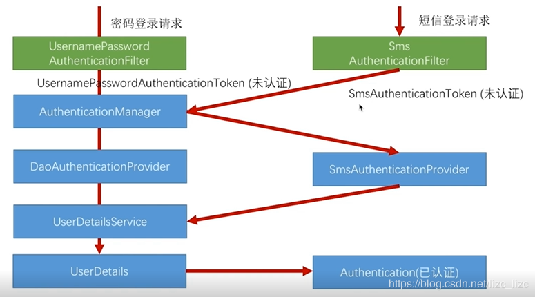

## SpringSecurity

> 本章在入门篇的基础上增加图片验证码登录和短信验证码登录

### 1 图片验证码登录

#### 1.1 登录页面增加图片验证码域
页面加载时会请求接口，接口返回一个验证码图片
```html
<!DOCTYPE html>
<html lang="en">
<head>
    <meta charset="UTF-8">
    <title>登录</title>
</head>
<body>
<div>
    <form action="/auth/form" method="post">
        <div>
            <label>用户名</label><input type="text" name="loginusername"/>
        </div>
        <div>
            <label>密码</label><input type="password" name="loginpassword"/>
        </div>
        <!--图片验证码-->
        <div>
            <label for="imageCode">图形验证码</label>
            <input type="input" id="imageCode" name="imageCode" required>
            
        </div>
        <div>
            <input type="submit">
        </div>
    </form>
</div>

</body>
</html>
```
#### 1.2 声明一个封装验证码信息的实体类

> 声明一个封装验证码信息的基类`study.wyy.security.validatecode.ValidateCode`
```java
package study.wyy.security.validatecode;

import lombok.Data;

import java.time.LocalDateTime;

/**
 * @author wyaoyao
 * @data 2019-11-04 08:10
 * 封装验证码信息的基类
 */
@Data
public class ValidateCode {
    /**
     * 验证码长度
     */
    int length;
    /**
     * 过期时间
     */
    private LocalDateTime expireTime;
    /**
     * 验证码内容
     */
    private String code;

}
```

> 声明一个图片验证码的实体类，继承验证码信息的基类`study.wyy.security.validatecode.ImageCode`
```java
package study.wyy.security.validatecode;

import lombok.Data;

import java.awt.image.BufferedImage;
import java.time.LocalDateTime;

@Data
public class ImageCode extends ValidateCode {
    /**
     * 图片宽度
     */
    private int width;

    private int height;


    private BufferedImage image;

    public ImageCode(String code, BufferedImage image, int expireTime) {
        this.setCode(code);
        this.image = image;
        this.setExpireTime(LocalDateTime.now().plusSeconds(expireTime)); 
    }

   
}
```

#### 1.3 生成验证码
> 声明一个验证码生成器器接口`study.wyy.security.validatecode.ValidateCodeGenerator`
```java
package study.wyy.security.validatecode;

/**
 * @author wyaoyao
 * @data 2019-11-04 08:36
 * 验证码生成器接口
 */
public interface ValidateCodeGenerator {

    ValidateCode createCode();
}

```
> 声明一个图片验证码生成器`study.wyy.security.validatecode.ImageValidateCodeGenerator`，实现接口

```java
package study.wyy.security.validatecode;

import java.awt.*;
import java.awt.image.BufferedImage;
import java.util.Random;
public class ImageValidateCodeGenerator implements ValidateCodeGenerator{


    @Override
    public ValidateCode createCode() {
        int width = 67;
        int height = 23;
        BufferedImage image = new BufferedImage(width, height, BufferedImage.TYPE_INT_RGB);

        Graphics g = image.getGraphics();

        Random random = new Random();

        g.setColor(getRandColor(200, 250));
        g.fillRect(0, 0, width, height);
        g.setFont(new Font("Times New Roman", Font.ITALIC, 20));
        g.setColor(getRandColor(160, 200));
        for (int i = 0; i < 155; i++) {
            int x = random.nextInt(width);
            int y = random.nextInt(height);
            int xl = random.nextInt(12);
            int yl = random.nextInt(12);
            g.drawLine(x, y, x + xl, y + yl);
        }

        String code = "";
        for (int i = 0; i < 4; i++) {
            String rand = String.valueOf(random.nextInt(10));
            code += rand;
            g.setColor(new Color(20 + random.nextInt(110), 20 + random.nextInt(110), 20 + random.nextInt(110)));
            g.drawString(rand, 13 * i + 6, 16);
        }

        g.dispose();

        return new ImageCode(code, image, 60);

    }

    /**
     * 生成随机背景条纹
     *
     * @param fc
     * @param bc
     * @return
     */
    private Color getRandColor(int fc, int bc) {
        Random random = new Random();
        if (fc > 255) {
            fc = 255;
        }
        if (bc > 255) {
            bc = 255;
        }
        int r = fc + random.nextInt(bc - fc);
        int g = fc + random.nextInt(bc - fc);
        int b = fc + random.nextInt(bc - fc);
        return new Color(r, g, b);
    }
}
```
并将生成器注入到Spring容器中
```java
@Bean
@ConditionalOnMissingBean(ImageValidateCodeGenerator.class)
public ValidateCodeGenerator imageValidateCodeGenerator(){
    return new ImageValidateCodeGenerator();
}
```
#### 1.4 声明Controller获取图片验证码
```java
package study.wyy.security.web.controller;

import lombok.extern.slf4j.Slf4j;
import org.springframework.beans.factory.annotation.Autowired;
import org.springframework.web.bind.annotation.GetMapping;
import org.springframework.web.bind.annotation.RestController;
import study.wyy.security.validatecode.ImageCode;
import study.wyy.security.validatecode.ValidateCodeGenerator;

import javax.imageio.ImageIO;
import javax.servlet.http.HttpServletRequest;
import javax.servlet.http.HttpServletResponse;
import java.io.IOException;

@RestController
@Slf4j
public class ValidateCodeController {

    @Autowired
    private ValidateCodeGenerator imageValidateCodeGenerator;

    private String IMAGE_CODE_KEY = "SESSION_KEY_IMAGE_CODE";

    @GetMapping("/code/image")
    public void imageCode(HttpServletRequest request,HttpServletResponse response) throws IOException {
        ImageCode code = (ImageCode) imageValidateCodeGenerator.createCode();
        log.info("图片验证码为：{}",code.getCode());
        // 将验证码存到session中，后续验证的时候从session中获取
        request.getSession().setAttribute(IMAGE_CODE_KEY,code);
        ImageIO.write(code.getImage(), "JPEG", response.getOutputStream());
    }
}
```
在配置该请求不需要被拦截`study.wyy.security.config.SecurityConfig`

> 至此生成验证码逻辑已经实现，可访问登录页测试

#### 1.5 优化代码，将一些信息改为用户可配置的
验证码的长度，图片的宽度等

> 声明一个全局的Properties配置类`SecurityProperties`
```java
package study.wyy.security.properties;

import lombok.Data;
import org.springframework.boot.context.properties.ConfigurationProperties;
import org.springframework.stereotype.Component;

@ConfigurationProperties("wyy.security")
@Data
@Component
public class SecurityProperties {

    private ImageCodeProperties imageCode = new ImageCodeProperties();
}
```

> 声明一个图片验证码的Properties配置类 `study.wyy.security.properties.ImageCodeProperties`

```java
package study.wyy.security.properties;

import lombok.Data;

@Data
public class ImageCodeProperties {

    private int width = 67;
    private int height = 23;
    private int length = 4;
    

}
```

> 修改代码里写死的相关常量，改为获取配置文件的内容
```java
package study.wyy.security.validatecode;

import lombok.extern.slf4j.Slf4j;
import org.springframework.beans.factory.annotation.Autowired;
import study.wyy.security.properties.SecurityProperties;

import java.awt.*;
import java.awt.image.BufferedImage;
import java.util.Random;

@Slf4j
public class ImageValidateCodeGenerator implements ValidateCodeGenerator{

    @Autowired
    private SecurityProperties securityProperties;

    @Override
    public ValidateCode createCode() {
        int width = securityProperties.getImageCode().getWidth();
        int height = securityProperties.getImageCode().getHeight();
        BufferedImage image = new BufferedImage(width, height, BufferedImage.TYPE_INT_RGB);

        Graphics g = image.getGraphics();

        Random random = new Random();

        g.setColor(getRandColor(200, 250));
        g.fillRect(0, 0, width, height);
        g.setFont(new Font("Times New Roman", Font.ITALIC, 20));
        g.setColor(getRandColor(160, 200));
        for (int i = 0; i < 155; i++) {
            int x = random.nextInt(width);
            int y = random.nextInt(height);
            int xl = random.nextInt(12);
            int yl = random.nextInt(12);
            g.drawLine(x, y, x + xl, y + yl);
        }

        String code = "";
        log.info("图片验证码长度：{}",securityProperties.getImageCode().getLength());
        for (int i = 0; i < securityProperties.getImageCode().getLength(); i++) {
            String rand = String.valueOf(random.nextInt(10));
            code += rand;
            g.setColor(new Color(20 + random.nextInt(110), 20 + random.nextInt(110), 20 + random.nextInt(110)));
            g.drawString(rand, 13 * i + 6, 16);
        }

        g.dispose();

        return new ImageCode(code, image, 60);

    }

    /**
     * 生成随机背景条纹
     *
     * @param fc
     * @param bc
     * @return
     */
    private Color getRandColor(int fc, int bc) {
        Random random = new Random();
        if (fc > 255) {
            fc = 255;
        }
        if (bc > 255) {
            bc = 255;
        }
        int r = fc + random.nextInt(bc - fc);
        int g = fc + random.nextInt(bc - fc);
        int b = fc + random.nextInt(bc - fc);
        return new Color(r, g, b);
    }
}

```

> yaml配置样例
```yaml
wyy:
  security:
    image-code:
      length: 5
```

#### 1.6 验证图片验证码
> 声明一个验证码异常`study.wyy.security.exception.ValidateCodeException`

继承`org.springframework.security.core.AuthenticationException`,是Spring
Security提供的在认证过程中的出现异常的基类
> 声明一个图片验证码过滤器

该过滤器只拦截登录页面，主要用于校验验证码是否正确，如果校验失败就使用认证失败处理器处理, 
这里的认证失败处理就是将错误信息返回给前端(这里只是简单的做法)

```java
package study.wyy.security.web.filter;

import lombok.extern.slf4j.Slf4j;
import org.springframework.beans.factory.annotation.Autowired;
import org.springframework.stereotype.Component;
import org.springframework.util.StringUtils;
import org.springframework.web.bind.ServletRequestBindingException;
import org.springframework.web.bind.ServletRequestUtils;
import org.springframework.web.bind.annotation.RequestMethod;
import org.springframework.web.context.request.ServletWebRequest;
import org.springframework.web.filter.OncePerRequestFilter;
import study.wyy.security.exception.ValidateCodeException;
import study.wyy.security.handler.MyFailHandler;
import study.wyy.security.validatecode.ImageCode;
import study.wyy.security.web.controller.ValidateCodeController;

import javax.servlet.FilterChain;
import javax.servlet.ServletException;
import javax.servlet.http.HttpServletRequest;
import javax.servlet.http.HttpServletResponse;
import javax.servlet.http.HttpSession;
import java.io.IOException;

/**
 * OncePerRequestFilter 是Spring提供的一个过滤器工具类，保证一次请求只会调用一次
 */
@Slf4j
@Component
public class ImageValidateCodeFilter extends OncePerRequestFilter {
    // 注入失败处理器，处理验证失败

    @Autowired
    MyFailHandler myFailHandler;
    @Override
    protected void doFilterInternal(HttpServletRequest httpServletRequest, HttpServletResponse httpServletResponse, FilterChain filterChain) throws ServletException, IOException {
        log.info("请求路径URI：{}", httpServletRequest.getRequestURI());
        log.info("请求路径URL：{}", httpServletRequest.getRequestURL());
        // 该过滤器只拦截登录页面，主要用于校验验证码是否正确，
        if("/auth/form".equals(httpServletRequest.getRequestURI()) && RequestMethod.POST.toString().equals(httpServletRequest.getMethod())){
            try {
                validate(new ServletWebRequest(httpServletRequest));
            }catch (ValidateCodeException e){
                log.info(e.getMessage());
                myFailHandler.onAuthenticationFailure(httpServletRequest,httpServletResponse,e);
            }

        }
        filterChain.doFilter(httpServletRequest, httpServletResponse);

    }

    private void validate(ServletWebRequest servletWebRequest) throws ServletRequestBindingException {
        HttpSession session = servletWebRequest.getRequest().getSession();
        ImageCode codeInSession = (ImageCode) session.getAttribute(ValidateCodeController.IMAGE_CODE_KEY);
        // 获取请求中提交的图片验证码
        String codeInRequest = ServletRequestUtils.getStringParameter(servletWebRequest.getRequest(), "imageCode");

        if (StringUtils.isEmpty(codeInRequest)) {
            throw new ValidateCodeException("验证码不能为空");
        }

        if (codeInSession == null) {
            throw new ValidateCodeException("验证码不存在");
        }

        if (codeInSession.isExpried()) {
            session.removeAttribute(ValidateCodeController.IMAGE_CODE_KEY);
            throw new ValidateCodeException("验证码已过期");
        }

        if (!codeInRequest.equals(codeInSession.getCode())) {
            throw new ValidateCodeException("验证码不匹配");
        }
        session.removeAttribute(ValidateCodeController.IMAGE_CODE_KEY);
    }
}


```
#### 1.7 在SpringSecurity过滤器链上加入该过滤器
```java
package study.wyy.security.config;

import org.springframework.beans.factory.annotation.Autowired;
import org.springframework.context.annotation.Configuration;
import org.springframework.security.config.annotation.web.builders.HttpSecurity;
import org.springframework.security.config.annotation.web.configuration.EnableWebSecurity;
import org.springframework.security.config.annotation.web.configuration.WebSecurityConfigurerAdapter;
import org.springframework.security.web.authentication.AuthenticationFailureHandler;
import org.springframework.security.web.authentication.AuthenticationSuccessHandler;
import org.springframework.security.web.authentication.UsernamePasswordAuthenticationFilter;
import study.wyy.security.web.filter.ImageValidateCodeFilter;


/**
 * @author wyaoyao
 * @data 2019-10-30 10:41
 */
@Configuration
@EnableWebSecurity
public class SecurityConfig extends WebSecurityConfigurerAdapter {

    @Autowired
    AuthenticationSuccessHandler mySuccessHandler;
    @Autowired
    AuthenticationFailureHandler myFailHandler;
    @Autowired
    ImageValidateCodeFilter imageValidateCodeFilter;
    @Override
    protected void configure(HttpSecurity http) throws Exception {
        http.authorizeRequests()
                 // 配置注册接口和swagger接口不需要身份验证
                .antMatchers("/register").permitAll()
                .antMatchers("/css/**", "/index", "/test/**", "/swagger**").permitAll()
                 // 配置登录页面不被拦截
                .antMatchers("/login.html").permitAll()
                .antMatchers("/auth/login").permitAll()
                // 配置图片验证码不需要被拦截
                .antMatchers("/code/image").permitAll()
                .anyRequest()
                .authenticated()
                .and()
            //在SpringSecurity过滤器链上加入图片验证码过滤器，放在UsernamePasswordAuthenticationFilter前面
            .addFilterBefore(imageValidateCodeFilter, UsernamePasswordAuthenticationFilter.class)
            // form表单登录
            .formLogin()
                // 指定登录页面
                .loginPage("/login.html")
                // 处理登录请求的url
                .loginProcessingUrl("/auth/form")
                // 修改登录请求的参数key
                .usernameParameter("loginusername")
                .passwordParameter("loginpassword")
                // 配置认证成功处理器
                .successHandler(mySuccessHandler)
                // 配置认证失败处理器
                .failureHandler(myFailHandler);
        
        http.csrf().disable();
    }
}
```
### 2 短信验证码快捷登录`study.wyy.security.sms`
仿照用户名和密码登录编写一个短信验证码登录



> 在login.html提供一个短信的登录入口
这里实现的比较简单，已经ajax发送请求的时候，应该先获取手机号输入框的手机号
```html
<h3>短信登录</h3>
<form action="/authentication/mobile" method="post">
    <table>
        <tr>
            <td>手机号:</td>
            <td><input type="text" name="mobile" value="13012345678"></td>
        </tr>
        <tr>
            <td>短信验证码:</td>
            <td>
                <input type="text" name="smsCode">
                <button onclick="getSmsCode()">获取验证码</button>
            </td>
        </tr>
       
        <tr>
            <td colspan="2"><button type="submit">登录</button></td>
        </tr>
    </table>
</form>
<script>
function getSmsCode() {
            var ajax = new XMLHttpRequest();
            ajax.open('get','/code/sms?mobile=13012345678');
            ajax.send();
        }
</script>


```
#### 2.1 提供一个封装短信验证码的实体`study.wyy.security.sms.SmsCode`
#### 2.2 提供一个发送短信的接口：`study.wyy.security.sms.SmsSender`
#### 2.3 提供一个短信发送的实现类：`study.wyy.security.sms.DefalutSmsSender`
#### 2.4  提供一个获取短信验证码的http接口：


#### 2.5 提供一个SmsCodeAuthenticationToken，仿照`org.springframework.security.authentication.UsernamePasswordAuthenticationToken`实现即可

用于封装用户认证信息

#### 2.6 SmsCodeAuthenticationFilter，同样仿照`org.springframework.security.web.authentication.UsernamePasswordAuthenticationFilter`

用于拦截短信登录请求，获取请求参数，并封装SmsCodeAuthenticationToken
```java
package study.wyy.security.web.filter;

import lombok.extern.slf4j.Slf4j;
import org.springframework.lang.Nullable;
import org.springframework.security.authentication.AuthenticationServiceException;
import org.springframework.security.core.Authentication;
import org.springframework.security.core.AuthenticationException;
import org.springframework.security.web.authentication.AbstractAuthenticationProcessingFilter;
import org.springframework.security.web.util.matcher.AntPathRequestMatcher;
import org.springframework.stereotype.Component;
import org.springframework.util.Assert;
import study.wyy.security.sms.SmsCodeAuthenticationToken;

import javax.servlet.http.HttpServletRequest;
import javax.servlet.http.HttpServletResponse;

@Slf4j
public class SmsCodeAuthenticationFilter extends
        AbstractAuthenticationProcessingFilter {


    //public static final String SPRING_SECURITY_FORM_USERNAME_KEY = "username";
    //public static final String SPRING_SECURITY_FORM_PASSWORD_KEY = "password";
    /**
     * 这里获取的请求参数就是用户的手机号
     */
    public static final String SPRING_SECURITY_FORM_MOBILE_KEY = "mobile";
    private String mobileParameter = SPRING_SECURITY_FORM_MOBILE_KEY;
    private boolean postOnly = true;

    /**
     这里处理的就是短信验证码的请求/authentication/mobile
     */
    public SmsCodeAuthenticationFilter() {
        super(new AntPathRequestMatcher("/authentication/mobile", "POST"));
    }
    // 核心逻辑
    public Authentication attemptAuthentication(HttpServletRequest request,
                                                HttpServletResponse response) throws AuthenticationException {
        if (postOnly && !request.getMethod().equals("POST")) {
            throw new AuthenticationServiceException(
                    "Authentication method not supported: " + request.getMethod());
        }
        // 获取请求中提交的手机号
        String mobile = obtainMobile(request);
        log.info("用户输入的手机号为：{}",mobile);
        if (mobile == null) {
            mobile = "";
        }
        mobile = mobile.trim();
        // 构造SmsCodeAuthenticationToken，注意此时还未认证的构造方法
        SmsCodeAuthenticationToken authRequest = new SmsCodeAuthenticationToken(mobile);
        setDetails(request, authRequest);
        // 进行认证逻辑
        return this.getAuthenticationManager().authenticate(authRequest);
    }

    @Nullable
    protected String obtainMobile(HttpServletRequest request) {
        return request.getParameter(mobileParameter);
    }

  
    protected void setDetails(HttpServletRequest request,
                              SmsCodeAuthenticationToken authRequest) {
        authRequest.setDetails(authenticationDetailsSource.buildDetails(request));
    }

    public void setMobileParameter(String mobileParameter) {
        Assert.hasText(mobileParameter, "Username parameter must not be empty or null");
        this.mobileParameter = mobileParameter;
    }
    
    public void setPostOnly(boolean postOnly) {
        this.postOnly = postOnly;
    }

    public final String getMobileParameter() {
        return mobileParameter;
    }
}
```
 
#### 2.7  SmsCodeAuthenticationProvider实现`org.springframework.security.authentication.AuthenticationProvider`接口

根据之前的源码阅读，SpringSecurity的认证都是交给一堆Provider去做的，这里我们就自己定义一个Provider
交给AuthManager

- 实现 AuthenticationProvider 接口，实现 authenticate() 和 supports() 方法。
- supports方法：根据这个方法，来确定当前的provider是否支持处理传入的AuthenticationToken
- authenticate() 方法处理验证逻辑
详细的内容都在`study.wyy.security.sms.SmsCodeAuthenticationProvider`注释的中

#### 2.8  `study.wyy.security.service.UserInfoService`声明一个方法loadUserByMobile，在其实现类中实现该方法

此方方法和loadUserByUsername一样的作用，这个就是通过手机号去数据库获取用户信息
```java
@Override
public UserDetails loadUserByMobile(String mobile) {

    // 根据手机号去查询数据库
    UserInfoExample example = new UserInfoExample();
    UserInfoExample.Criteria criteria = example.createCriteria();
    criteria.andMobileEqualTo(mobile);
    List<UserInfo> userInfos = userInfoMapper.selectByExample(example);
    if(userInfos.size() ==0){
        log.info("当前手机号未注册");
        // 说明没有有该用户，此时就应该执行注册的逻辑, 并赋默认权限，这里由于没有做权限，就不做这个处理
        create(buildByMobile(mobile));
        // 返回这个新建的用户
        UserInfo userInfo = new UserInfo();
        userInfo.setMobile(mobile);
        userInfo.setAuthorities(AuthorityUtils.commaSeparatedStringToAuthorityList("admin"));
        return userInfo;

    }
    UserInfo userInfo = userInfos.get(0);
    log.info("数据库用户信息：{}",userInfo);
    userInfo.setAuthorities(AuthorityUtils.commaSeparatedStringToAuthorityList("admin"));
    return userInfo;

}
```

#### 2.9 加入SpringSecurity配置
之前，都是直接往 WebSecurityConfig 中加，但是这样会导致 WebSecurityConfig 内容太多，难以维护。
因此新建一个配置类，再把这个配置文件加入到 WebSecurityConfig 中，进行解耦。创建一个配置类

```java
package study.wyy.security.config;

import org.springframework.beans.factory.annotation.Autowired;
import org.springframework.security.authentication.AuthenticationManager;
import org.springframework.security.config.annotation.SecurityConfigurerAdapter;
import org.springframework.security.config.annotation.web.builders.HttpSecurity;
import org.springframework.security.web.DefaultSecurityFilterChain;
import org.springframework.security.web.authentication.UsernamePasswordAuthenticationFilter;
import study.wyy.security.handler.MyFailHandler;
import study.wyy.security.handler.MySuccessHandler;
import study.wyy.security.service.UserInfoService;
import study.wyy.security.sms.SmsCodeAuthenticationProvider;
import study.wyy.security.web.filter.SmsCodeAuthenticationFilter;

@Component
public class SmsCodeAuthenticationSecurityConfig extends SecurityConfigurerAdapter<DefaultSecurityFilterChain, HttpSecurity> {

    @Autowired
    UserInfoService userInfoService;
    @Autowired
    MyFailHandler myFailHandler;
    @Autowired
    MySuccessHandler mySuccessHandler;

    @Override
    public void configure(HttpSecurity http)  {
        // 设置SmsCodeAuthenticationFilter
        SmsCodeAuthenticationFilter smsCodeAuthenticationFilter = new SmsCodeAuthenticationFilter();
        smsCodeAuthenticationFilter.setAuthenticationManager(http.getSharedObject(AuthenticationManager.class));
        // 设置我们的失败成功处理器
        smsCodeAuthenticationFilter.setAuthenticationSuccessHandler(mySuccessHandler);
        smsCodeAuthenticationFilter.setAuthenticationFailureHandler(myFailHandler);

        SmsCodeAuthenticationProvider smsCodeAuthenticationProvider = new SmsCodeAuthenticationProvider();
        smsCodeAuthenticationProvider.setUserInfoService(userInfoService);

        http.authenticationProvider(smsCodeAuthenticationProvider)
                .addFilterAfter(smsCodeAuthenticationFilter, UsernamePasswordAuthenticationFilter.class);
    }

}
```
> SmsCodeAuthenticationSecurityConfig加入到 WebSecurityConfig 中了。

首先将 SmsCodeAuthenticationSecurityConfig 注入进来，然后通过 http.apply(xxx) 添加进去。